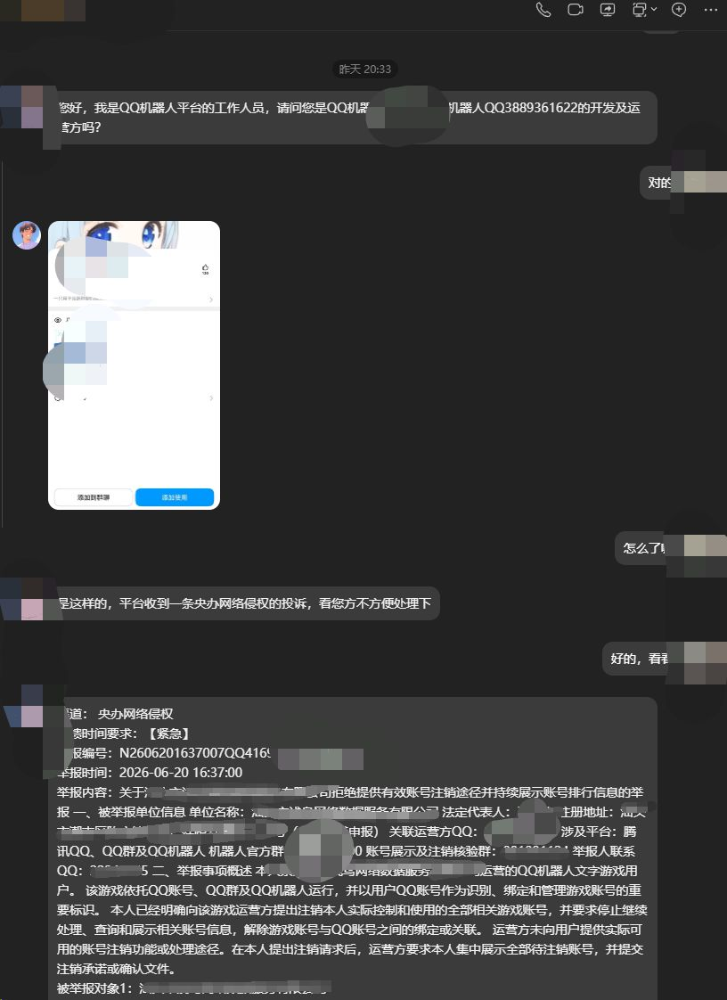

<div align="center">

# TRSS-Yunzai QQBot Plugin

TRSS-Yunzai QQBot 嘿群主壳 插件

</div>

# Tip

建议使用TRSS原版,此版本为`嘿壳`版,会在`任意时间`直接进行罚壳,且`不会`与TRSS一致


---

**功能优化**

- 修复重连成功误判、白名单拒连反复重试
- 适配 ref_idx 撤回与 callfl，避免撤回失败
- 好友删除后自动标记为不可召回，避免无效发送
- invite 拉入/踢出同群去重，排行支持分页查看
- 召回设置支持时间偏移（1-23 小时），偏移后所有时间跟随调整
- 成员昵称缓存：群消息兜底获取昵称，无缓存时显示 openid

**新增功能**

| 功能 | 说明 |
|------|------|
| 虚拟 at_id | 纯数字 ID，去掉 self_id 前缀与手机号形态 |
| 全量忽略@全体 | 可关闭“仅回复@机器人”，忽略 @全体 的指令 |
| 群事件开关 | `#QQBot普通设置 群事件 开启/关闭`，默认关闭 |
| 进群欢迎 | 开启群事件后，任意群被动回复欢迎消息 |
| 退群通知 | 开启后仅全量已记录群主动发送退群通知 |
| 全量拉黑 | `#QQBot全量拉黑 群openid` / `#QQBot全量删黑 群openid` |
| 全量拉黑菜单 | `#QQBot全量拉黑菜单`，查看已拉黑列表 |
| 拉黑联动 | 全量查看列表标注「已拉黑/正常」，拉黑群仅 @机器人 触发 |
| 群消息角色图标 | 群主👑 管理⭐ 成员👥，机器人额外🤖 |
| 发言记录 | `this.e.raw.chat` 按用户区分群/私聊，含今日/昨日/7天/30天 |
| DAU 好友统计 | 新增好友数、删除好友数，兼容旧数据缺字段按 0 显示 |
| 高级群欢迎 | 入群事件欢迎通知、单群额度、投诉关闭、详情查看，详见 `advanced_welcome.md` |

## 用户管理

已按 `新需求.txt` 新增独立用户管理能力，未修改 `node_modules`。相关改动文件：`index.js`、`Model/config.js`、`Model/index.js`，新增 `Model/userManageStore.js`。

### 存储

- 新增独立用户管理存储，路径为 `QQBot-Plugin/db/userManage`，不混用全量消息、高级欢迎等已有数据。
- 按机器人 `self_id` 分离配置与数据，多个 Bot 之间互不影响。
- 记录用户、群、群成员关系、拉黑、注销、最近发言、绑定全量缓存、全量事件检测状态。
- 频道数据不参与用户管理拉黑、查询和群/好友缓存污染写入。

### 菜单入口

```text
#QQBot用户管理菜单
#QQBot用户管理菜单 注销菜单
#QQBot用户管理菜单 拉黑菜单
#QQBot用户管理菜单 查询菜单
```

- `#QQBot帮助` 中原“全量拉黑”入口已替换为“用户管理”。
- 菜单按钮遵守每排最多 2 个、最多 5 排、按钮文字不超过 6 字。
- 主菜单展示 UA 状态、UA 内容、时间偏移和用户自由开启全量命令提示。

### 注销

```text
#机器人用户注销 self_id openid
#机器人用户注销确认 确认码
#机器人用户注销撤回 self_id
#QQBot注销管理 查看 1
#QQBot注销管理 撤回 openid
#QQBot注销管理 设置注销时间 7天
#QQBot注销管理 设置注销拉黑时间 3650天
#QQBot注销管理 强制注销 openid 理由
```

- 注销为文案效果，不真实删除数据。
- 普通注销需确认码，确认码 1 分钟有效；机器人主人不能注销自己。
- 注销中和注销拉黑期会拦截外部插件命令，并提示撤回或剩余不可用天数。
- 强制注销立即进入不可用状态，可附带理由；强制注销只有开发者可撤回。
- `this.e.raw.iscancelled` 在注销中或注销拉黑期为 `true`，否则为 `false`。
- `#QQBot`、`#qbot`、`#机器人用户注销` 相关内部命令不受注销拦截。



### 拉黑

```text
#QQBot拉黑用户 openid 理由
#QQBot删黑用户 openid
#QQBot拉黑群 群openid 理由
#QQBot删黑群 群openid
#QQBot查看拉黑 用户 1
#QQBot查看拉黑 群 1
#QQBot拉黑设置 返回理由 开启
#QQBot拉黑设置 返回理由 关闭
```

- 支持用户和群拉黑，频道不写拉黑机制。
- 被拉黑用户或群触发外部命令时，不再分发给外部插件。
- 默认返回拉黑理由；关闭返回理由后静默拦截。
- 禁止触发命令的用户拉黑自己。
- 内部 `#QQBot/#qbot` 命令不受拉黑拦截，方便管理恢复。

### 查询

```text
#QQBot查看所有用户 1
#QQBot搜索用户 用户名
#QQBot查看用户所在群 openid
#QQBot查看所有群 1
#QQBot查看群成员 群openid 1
#QQBot查看群最近发言 群openid 20
#QQBot查看群最近发言 群openid #seq
#QQBot删除群最近发言 群openid 20
#QQBot删除群最近发言 群openid 全部
#QQBot备注群名称 群openid 群名
#QQBot备注真实群号 群openid 群号
```

- 用户、群、群成员列表均支持分页，每页 10 条。
- 群列表支持备注群名、备注真实群号、全量群/非全量群标识、查看最近发言、拉黑/删黑快捷入口。
- 最近发言支持按条数查看，也支持 `#seq` 查看对应记录的 `raw` JSON。
- 群聊缓存发言可按单群删除，也可在用户管理菜单中清空全部群聊缓存。
- `#QQBot用户管理菜单 时间加 8` 可设置用户管理展示时间偏移，`0` 表示关闭偏移。

### 历史接口

- `this.e.seq` 表示当前消息在对应群聊或私聊历史里的序号。
- `this.e.source.seq` 表示被引用消息的序号，支持消息 ID 和内容指纹回退匹配。
- `this.e.group.getChatHistory(seq, count)` 获取群聊历史。
- `this.e.friend.getChatHistory(seq, count)` 和 `this.e.friendgetChatHistory(seq, count)` 获取私聊历史。
- `count=0` 返回 `[]`，`count=1` 返回指定 `seq`，`count=2` 返回 `seq` 和 `seq-1`。
- 历史记录保存完整 `raw_message`，不截断，并保存原始事件快照供 raw 查询。

### UA 设置

```text
#QQBot用户管理 设置ua QQBotPlugin/9.9.9 (Node/20.11.0; Linux; QQbot/1.0.19)
#QQBot用户管理 ua开启
#QQBot用户管理 ua关闭
```

- UA 配置按机器人分离，默认关闭。
- 未设置 UA 时开启，会使用默认值 `QQBotPlugin/9.9.9 (Node/20.11.0; Linux; QQbot/1.0.19)`。
- UA 会应用到 `getAppAccessToken`、`/gateway/bot` HTTPS 请求和 WSS 握手。
- UA 开关或内容修改后，需要重启框架或等待 WS 机制重连才完全生效。
- 非 ASCII UA 内容会自动编码，避免 Node HTTP header 报错。

### 用户自由开启全量

```text
#我要开启全量 群号
#我要开启全量群号
#我要开启全量
我要开启全量 群号
我要开启全量群号
我要开启全量
#QQBot查看用户绑定全量 1
#QQBot删除用户绑定全量缓存
```

- `#` 可选，群号前空格可选；群号必须是 5 到 10 位纯数字，非法输入不会回显。
- 未输入群号时提示“没有输入群号”，并返回 `我要开启全量` qbotcmd 与指令按钮，保留开启步骤说明。
- 命令仅 QQ 群群主可用，非群主会提示当前身份：群主、管理员或群员。
- 机器人 `self_id` 自动取当前机器人，无需用户输入。
- 回复官方授权 Markdown，并带“点击开启全量”链接按钮，按钮仅触发者可点击。
- 同一用户同一群只信任第一次输入的群号，绑定成功后后续错误输入不会覆盖缓存群号。
- 收到该群一次 `GROUP_MESSAGE_CREATE` 全量事件后，用户管理独立记录为已开启，不依赖“全量消息设置 记录群”开关。
- 当前群已检测到全量时，再次发送开启命令会提示“当前群已经开启全量，再次访问链接可以关闭”，并保留第 5 条高级功能说明。
- `#QQBot查看用户绑定全量 1` 展示触发用户 openid、群 openid、昵称、时间和是否检测到开启。

### 其他修复

- gl/fl 缓存清理频道形态数据，避免 `qg_`、``、频道来源字段和异常值污染群/好友列表。
- 高级群欢迎重复开启或关闭时提示“当前群已经开启/关闭”。
- `/gateway/bot`、频率限制、可恢复 400 错误日志增加 trace 信息，便于定位 SDK 与网关错误。
- 重连状态机区分官方 reset 等待和失败重试等待，并使用轮次 token 避免旧流程覆盖新状态。

### `this.e.raw.chat`

`this.e.raw.chat` 来自发言统计，常见结构如下：

```js
{
  user_openid: '...',
  scope: 'group' | 'private' | '',
  target_openid: '...',
  today: 0,
  yesterday: 0,
  week: 0,
  month: 0,
  total: {
    today: 0,
    yesterday: 0,
    week: 0,
    month: 0
  },
  breakdown: {
    today: { group: 0, private: 0 },
    yesterday: { group: 0, private: 0 },
    week: { group: 0, private: 0 },
    month: { group: 0, private: 0 }
  }
}
```

说明：

- `Breakdown` 表示按会话类型拆分后的明细统计。
- `group` 是群聊发言数，`private` 是私聊发言数。
- 顶层的 `today / yesterday / week / month` 是当前 `scope` 对应会话的统计值。
- `total` 是不区分会话类型的合计值。
- `scope` 为空时，通常表示只拿到了汇总统计，没有指定当前会话。

外部插件可通过 `this.e.otherchat(userOpenid, groupOpenid)` 查询指定用户发言统计：

- `userOpenid` 必填，传用户 openid。
- `groupOpenid` 可选，传群 openid 时返回该用户在指定群的统计。
- 返回结构与 `this.e.raw.chat` 一致，包含 `today / yesterday / week / month`。
# QQBot 高级群欢迎

高级群欢迎用于在用户入群事件触发时发送官方 Markdown 欢迎通知，主要解决群聊遗忘机器人后无法主动触达的问题。功能按机器人 QQ 分开配置，数据独立存储在 LevelDB，不依赖普通群事件开关。

## 入口

主菜单中的原“QQ转换”入口已替换为“高级群欢迎”。

```text
#QQBot高级群欢迎菜单
```

菜单按钮：`高级群欢迎`

qbotcmd：`高级群欢迎菜单`

## 工作方式

- 使用官方入群事件作为被动通知发送依据。
- 不受 `#QQBot普通设置 群事件 开启/关闭` 影响，该开关只控制外部插件群事件通知。
- 按机器人 QQ 独立配置，多个 Bot 不互相影响。
- 高频数据使用独立 LevelDB，路径为 `QQBot-Plugin/db/advancedWelcome`。
- 成功发送才计入次数额度，失败不计入成功次数。
- 退群事件只记录统计，不发送欢迎通知。

## 基础配置

```text
#QQBot高级群欢迎菜单
#QQBot高级群欢迎设置 总开关 开启
#QQBot高级群欢迎设置 总开关 关闭
#QQBot高级群欢迎设置 Markdown ><@openid>欢迎新人！
#QQBot高级群欢迎设置 button {按钮JSON}
#QQBot高级群欢迎设置 删除按钮
#QQBot高级群欢迎预览
```

说明：

- 必须先配置 Markdown 才能开启总开关。
- 按钮可选；未配置按钮时只发送 Markdown。
- 删除按钮会把按钮恢复为未配置，不影响 Markdown 和总开关。
- Markdown 中的 `<@openid>` 会在发送时替换为入群用户 openid。

## 推荐配置

```text
#QQBot高级群欢迎设置 推荐MD
#QQBot高级群欢迎设置 推荐按钮
```

推荐 Markdown：

```text
><@openid>欢迎新人！
```

推荐按钮会自动生成当前机器人 QQ 的两个操作：

- `关闭通知`：`#我要关闭通知 当前机器人QQ`
- `投诉通知`：`#我要投诉通知 当前机器人QQ`

## 次数限制

支持以下单群额度：

```text
#QQBot高级群欢迎设置 单群总次数 3
#QQBot高级群欢迎设置 单群天次数 0
#QQBot高级群欢迎设置 单群周次数 0
#QQBot高级群欢迎设置 单群5小时次数 0
#QQBot高级群欢迎设置 单群1小时次数 0
#QQBot高级群欢迎设置 单群5分钟次数 0
#QQBot高级群欢迎设置 单群1分钟次数 0
```

规则：

- `0` 或 `无限` 表示不限制。
- 单群总次数默认 `3`。
- 其余额度默认不限制。
- 展示格式示例：`5时: 7/无限`。

## 限发与发言限制

```text
#QQBot高级群欢迎设置 限发间隔 15
#QQBot高级群欢迎设置 发言限制 30
```

说明：

- 限发间隔按秒计算，避免短时间重复欢迎。
- 发言限制只统计全量群消息 `GROUP_MESSAGE_CREATE`。
- 菜单中显示为“全量群消息状态: 可用/不可用，已统计N次”，避免用户误解为普通次数额度。
- 非全量群不会因为发言限制卡住发送。

## 查看与管理

```text
#QQBot高级群欢迎查看 1
#QQBot高级群欢迎查看关闭 1
#QQBot高级群欢迎查看投诉 1
#QQBot高级群欢迎查看错误 1
#QQBot高级群欢迎查看详情 群openid
#QQBot高级群欢迎关闭 群openid
#QQBot高级群欢迎开启 群openid
```

说明：

- 查看列表会展示每个群的状态、额度、加退群、发送失败、投诉等信息。
- 查看列表每个群条目后提供快捷 qbotcmd：开启/关闭此群、查看详情。
- qbotcmd 不放在代码块内，避免客户端无法识别。
- 如果群 openid 还没有记录，关闭/开启命令会提前创建状态并提示“群记录不存在，已提前关闭/开启”。

## 群员命令

```text
#我要关闭通知 当前机器人QQ
#我要开启通知 当前机器人QQ
#我要投诉通知 当前机器人QQ
#我要投诉通知 确认 确认码
#我要撤回投诉 当前机器人QQ
#我要撤回投诉通知 当前机器人QQ
```

权限规则：

- 群主/管理员可以直接关闭或开启当前群通知。
- 普通成员不能直接关闭；无权限时会提示投诉入口，并带 qbotcmd 与按钮。
- 普通成员投诉需要确认码，确认码 1 分钟有效。
- 同一用户同一群只记录一次有效投诉。
- 撤回投诉兼容 `#我要撤回投诉` 和 `#我要撤回投诉通知` 两种写法。

## 详情信息

```text
#QQBot高级群欢迎查看详情 群openid
```

详情包含：

- 群 openid
- 当前开启/关闭状态
- 加群/退群统计
- 发送/失败统计
- 全量群消息状态和统计次数
- 总/天/周/5时/1时/5分/1分额度
- 最近发送时间
- 最近失败原因
- 投诉用户 openid 与时间
- 撤回投诉用户 openid 与时间

## 关联能力

### this.e.chatrank()

新增 `this.e.chatrank(groupOpenid)`，返回当前群今日/昨日发言排行：

```js
{
  today: [],
  yesterday: [],
  todayWithBot: [],
  yesterdayWithBot: []
}
```

说明：

- 只对群聊有效。
- 默认排行排除机器人。
- `todayWithBot`、`yesterdayWithBot` 包含机器人。
- 已退群成员不再计入排行。

### this.e.recallMsg()

新增 `this.e.recallMsg(messageId, targetId, targetType)`，并兼容旧插件的 `e.group.recallMsg()` / `e.friend.recallMsg()`。

支持能力：

- 使用真实 `ROBOT1.0_...` 消息 ID 撤回。
- 自动处理外层事件 ID 与真实消息 ID 的映射。
- 支持 `REFIDX_...` 回复索引撤回。
- 当官方只给引用内容时，使用内容指纹回退匹配近期真实消息 ID。
- URL 编码消息 ID，避免 `/` 等字符破坏接口路径。
- 保护群主/管理员消息，不盲撤。

## 注意事项

- 高级群欢迎只作用于群聊。
- Markdown 删除不提供快捷入口；如果不想继续发送，关闭总开关即可。
- 按钮删除只影响按钮，不影响 Markdown。
- 投诉/关闭等 qbotcmd 必须放在代码块外。
- 全量群消息统计是发言限制判断依据，不是欢迎发送额度。


**关键命令速查**

```text
#QQBot普通设置 群事件 开启
#QQBot全量拉黑菜单
#QQBot全量拉黑 群openid
#QQBot全量删黑 群openid
#QQBot全量消息设置 忽略@全体的指令 开启
#QQBot召回设置 时间偏移 8
#QQBot普通设置 查看拉入排行
#QQBot普通设置 查看踢出排行
#QQBot高级群欢迎菜单
```


## 自用人机群主版
   - 新增QQ机器人认证错误处理，破冰，召回功能，发送语音适配官方文档
   - 新增只读错误、取消错误、WebSocket错误检测
   - 新增运行时定时器清理
   - 优化了ws超时的报错重连
   - `toCallback` 默认改为 `false`
   - 新增 `forceSilk` 配置
   - 新增 `icebreaker` 和 `recall` 配置对象
   - `fullMessageDB` 改为 `level` 存储
   
上传图片用法(需要自己的上传插件加载成功)

```js
// 网络图片
await Bot.uploadImage("https://example.com/a.png")

// 本地图片路径
await Bot.uploadImage("/root/qqbot/data/images/a.png")

// file 协议本地图片
await Bot.uploadImage("file:///root/qqbot/data/images/a.png")

// base64 图片
await Bot.uploadImage("base64://iVBORw0KGgoAAAANSUhEUgAA...")

// 图片 Buffer
const buffer = fs.readFileSync("/root/qqbot/data/images/a.png")
await Bot.uploadImage(buffer)
```

最简单写法：

```js
const image = await Bot.uploadImage("https://example.com/a.png")
```

返回：

```js
{
  url: "https://上传后的图片地址",
  width: 640,
  height: 360
}
```

如果要指定某个 QQBot 账号上传：

```js
const image = await Bot[3889000008].uploadImage("https://example.com/a.png")
```

>为了感谢龙虾，新增模拟龙虾在线。优化全量部分内容，优化多机器人配置，修复非本适配器可以触发命令的问题

>修复了dau无法统计的bug 修复了原生MD加模板按钮，单发按钮和原生MD的问题 修复了点击回调按钮msg_id越权的问题

>新增发送嘿壳的文件

>原生按钮开放，新增按钮生成器

>由于龙虾占用腾讯服务器，增加了ws断线检测和通知，24小时内没有次数了，机器人会被罚壳。已经增加嘿壳的自动重连(应该不会掉线？)

>新增掉线检测相关和全量消息相关命令，交互式按钮，请开启原生MD后使用 #qbot帮助查看

```javascript
// 1. 网络文件，自动文件名
segment.file("https://example.com/file.pdf")

// 2. 网络文件，自定义文件名(利用机制发送嘿壳.jpg，嘿壳.mp3)
segment.file("https://bbs.hycdn.cn/image/2026/01/24/500031/b3fcde82eed9639923cf532d84d6412e.jpg?a=https://嘿壳.jpg","无效参数.jpg")
segment.file("http://game.gtimg.cn/images/up/act/a20170301pre/media/bg.mp3","嘿壳.mp3",1)

// 3. 本地文件，绝对路径
segment.file("/root/yunzai/data/file.pdf", "文件.pdf")

// 4. 本地文件，相对路径
segment.file("./data/file.pdf", "文件.pdf")

// 5. file:// 协议本地文件
segment.file("file:///root/yunzai/data/file.pdf", "文件.pdf")

// 6. 强制分片上传
segment.file({
  file: "https://example.com/large.zip",
  name: "大文件.zip",
  force_chunk: 1
})

// 7. 不强制分片上传
segment.file({
  file: "https://example.com/file.pdf",
  name: "文件.pdf"
})

// 8. Buffer 文件上传
segment.file(buffer, "文件.pdf")

```
## 文件撤回示例

### 基础用法
```javascript
// 发送文件，20秒后自动撤回
segment.file("https://example.com/file.pdf", "文档.pdf", 0, 20)

// 参数说明：
// 参数1: 文件URL或路径
// 参数2: 文件名
// 参数3: force_chunk (0=自动判断, 1=强制分片上传)
// 参数4: recall_time (撤回时间，单位：秒，0=不撤回)
```

### 更多示例
```javascript
// 1. 普通文件，60秒后撤回
segment.file("https://example.com/data.zip", "人机模块.zip", 0, 60)

// 2. 强制分片上传，30秒后撤回
segment.file("https://example.com/large.mp4", "人机视频.mp4", 1, 30)

// 3. 本地文件，120秒后撤回
segment.file("file:///data/report.xlsx", "人机群主.xlsx", 0, 120)

// 4. 对象形式参数
segment.file({
  file: "https://example.com/file.txt",
  name: "文本.txt",
  force_chunk: 0,
  recall_time: 45
})

// 5. 私聊文件（自动分片），10秒后撤回
segment.file("https://example.com/secret.doc", "机密的嘿壳模块.doc", 0, 10)
```

### 注意事项
- `recall_time` 为 `0` 或不填时，不会自动撤回
- 撤回时间从文件发送成功开始计算
- 超过2分钟的消息无法撤回（QQ官方限制）
- 私聊文件会自动使用分片上传，`force_chunk` 参数无效

---

## 账号掉线检测与重连命令

### 总开关
```bash
# 开启掉线检测（总开关，必须先开启此项其他功能才生效）
#QQBot账号掉线检测 开启

# 关闭掉线检测
#QQBot账号掉线检测 关闭
```

### 掉线提醒
```bash
# 开启掉线提醒（会向所有管理员发送掉线通知）
#QQBot账号掉线提醒 开启

# 关闭掉线提醒
#QQBot账号掉线提醒 关闭
```

### 自动重连
```bash
# 开启自动重连（检测到掉线后自动尝试重连）
#QQBot账号掉线自动重连 开启

# 关闭自动重连
#QQBot账号掉线自动重连 关闭
```

### 检测时间间隔
```bash
# 设置检测间隔为1分钟（最小值）
#QQBot账号掉线检测时间设置 1分钟

# 设置检测间隔为5分钟（推荐值）
#QQBot账号掉线检测时间设置 5分钟

# 设置检测间隔为10分钟
#QQBot账号掉线检测时间设置 10分钟

# 设置检测间隔为30分钟（最大值）
#QQBot账号掉线检测时间设置 30分钟

# 支持范围：1-30 分钟
#QQBot账号掉线检测时间设置 15分钟
```

### 工作原理
1. **检测机制**：定时调用 `/gateway/bot` 接口查询 `session_start_limit.remaining`
2. **掉线判断**：`remaining === 0` 表示账号已掉线，无剩余连接次数
3. **重连流程**：
   - 检测到 `remaining === 0` 时，记录 `reset_after`（重置等待时间）
   - 发送掉线提醒（如已开启）
   - 等待 `reset_after` 毫秒后，再次检查 `remaining` 是否恢复
   - 若 `remaining > 0`，执行 `logout()` → `login()` 重连
   - 重连成功后发送通知（如已开启）

### 配置示例
```yaml
# config.yaml
offlineDetect:
  enabled: true           # 总开关
  notify: true            # 掉线提醒
  autoReconnect: true     # 自动重连
  interval: 5             # 检测间隔（分钟）
```

### 通知消息示例
```
掉线提醒：
[3889000008] 账号下线：[下线通知]你的帐号当前登录已失效，请5小时6分钟7秒后重新登录。
发送 /Bot上线3889000008 重新登录

重连成功：
[3889000008] 账号重连成功！

重连失败：
[3889000008] 自动重连失败：Connection timeout
```

1. 转发消息改为渲染成图片,需要安装`ws-plugin`
2. `#QQBot设置转换开启`配合`#ws绑定`实现互通数据
3. `#QQBotDAU` and `#QQBotDAUpro`
4. `Model/template/groupIncreaseMsg_default.js`中`自定义入群发送主动消息`
5. `config/QQBot.yaml`中使用以下自定义模版,如果设置了全局md会优先使用自定义模版,配合`e.toQQBotMD = true`将特定消息`转换`成md,亦可在`全局md模式下`通过`e.toQQBotMD = false`将特定消息`不转换`成md
   - 方法1: 直接修改`config/QQBot.yaml` **(推荐)**
     ```yml
     customMD:
       BotQQ:
         custom_template_id: 模版id
         keys:
           - key1 # 对应的模版key名字
           - key2
           # ... 最多10个
     ```
   - 方法2: 在`Model/template`目录下新建`markdownTemplate.js`文件,写入以下内容 **(不推荐)**
     ```js
     // params为数组,每一项为{key:string,values: ['\u200B']} // values固定为['\u200B']
     export defalut {
       custom_template_id: '',
       params: []
     }
     ```
6. `#QQBot调用统计` 根据`e.reply()`发送的消息进行统计,每条消息仅统计一次,未做持久化处理,默认关闭,`#QQBot设置调用统计开启`
7. `config/QQBot.yaml`中使用以下配置项,在`全局MD`时会`以MD的模式`自动加入`params`中
   ```yml
   mdSuffix:
     BotQQ:
       - key: key1
         values:
           - value # 如果用到了key则不会添加
       - key: key2
         values:
           # \ 需转义 \\
           - "{{ e.msg.replace(/^#/g, '\\/') }}" # {{}}中为动态参数,会在发送时替换成对应值,目前仅有e可用,也可以传入js表达式等等, 后续可能会添加自定义方法
       # ...
   ```
8. `config/QQBot.yaml`中使用以下配置项,在`全局MD`时会`以button的模式`自动加入`按钮指定行数并独占一行`,当`超过`5排按钮时`不会添加`
   ```yml
   btnSuffix:
     BotQQ:
       position: 1 # 位置:第几行 1 - 5
       values:
         - text: test
           callback: test
           show: # 达成什么条件才会显示
             type: random # 目前仅支持 random
             data: 50 # 0-100
         - text: test2
           input: test2
         # ... 最多10个
   ```
9. `#QQBot用户统计`: 对比昨日的用户数据,默认关闭,`#QQBot设置用户统计开启`
10. `config/QQBot.yaml`中使用前台日志消息过滤（~~自欺欺人大法~~），将会不在前台打印自定的消息内容，防log刷屏（~~比如修仙、宝可梦等~~），也可以使用`#QQBot添加/删除过滤日志垃圾机器人`
    - **自定义消息采取完整消息匹配，非关键词匹配**
    - **非必要不建议开启此项**
      > 注意：_只会过滤部分QQBot的日志_
    ```yml
    filterLog:
      BotQQ:
        - 群主是机器人
        - 垃圾bot
        - 垃圾Bot
        # ...
    ```
11. `config/QQBot.yaml`中`simplifiedSdkLog`是否简化sdk日志,若设置为`true`则不会打印` recv from Group(xxx):  xxx`,并且会简化发送为`send to Group(xxx): <markdown><button>`
12. ~~`#QQBot一键群发`: 需要先配置模版 `template/oneKeySendGroupMsg_default.js`~~
13. `config/QQBot.yaml`中`markdownImgScale: 1`是否对markdown中的图片进行等比例缩放,0.5为缩小50%,1.5为放大50%,以此类推
14. `config/QQBot.yaml`中`sendButton: true`未开启全局MD时是否单独发送按钮
15. `config/QQBot.yaml`中`dauDB: level`选择存储dau数据的数据库,可选: `level`, `redis`,以及`false`关闭dau统计(仅每日发言用户和群)
    - `level`
      - 优点: 统计了大部分数据
      - 缺点: 缓存存一份,level存一份
    - `redis`
      - 优点: 大部分使用redis存储,不会缓存
      - 缺点: 没有缓存所以有些没统计
16. 已适配YePanel,提供dau统计和设置功能
17. `config/QQBot.yaml`中`bus`是否使用ws中转站
- 使用ws中转站可以降低成本,只需要一台低性能云服务器即可通过IP白名单验证,后端可使用本地服务器
- 填写格式:
```
  bus: {
    BotQQ: "example.com"
  }
```
- 后端搭建[[QQBotWs](https://github.com/Admilkk/QQBotWs)]

## 安装教程

1. 准备：[TRSS-Yunzai](../../../Yunzai)
2. ~~输入：`#安装QQBot-Plugin`~~
3. 打开：[QQ 收缩平台](https://q.qq.com) 创建 Bot：  
   ① 创建机器人  
   ② 开发设置 → 得到 `机器人QQ号:AppID:Token:AppSecret`
4. 输入：`#QQBot设置机器人QQ号:AppID:Token:AppSecret:[01]:[01]`

## 格式示例

- 机器人QQ号 `114` AppID `514` Token `1919` AppSecret `810` 群Bot 频道私域

```
#QBot设置114:514:1919:810:1:1
```

## 高阶能力

<details><summary>Markdown 消息</summary>

已经嘿壳，感谢龙虾🦞

</details>

## 使用教程

- #QQBot账号
- #QQBot设置 + `机器人QQ号:AppID:Token:AppSecret:是否群Bot:是否频道私域`（是1 否0）
- #QQBotMD + `机器人QQ号:模板ID`
- #QQBotMD + `机器人QQ号:raw` 开启原生MD
- #QQBotMD + `机器人QQ号:` 关闭原生MD
